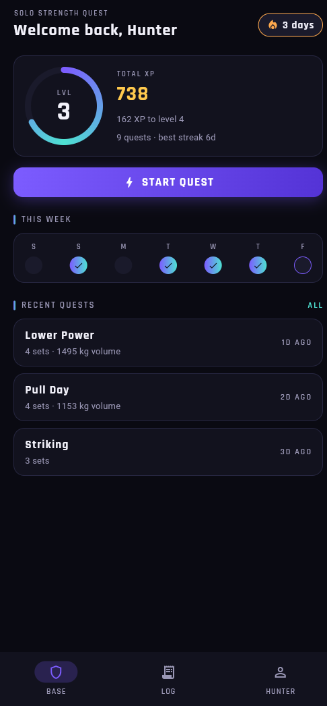
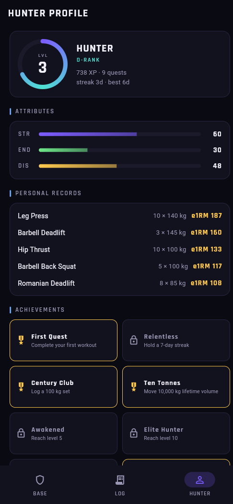
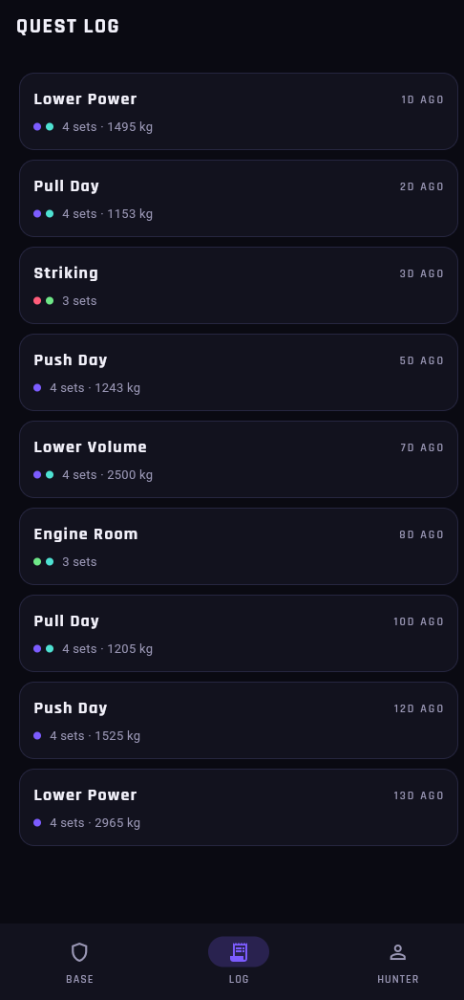

# Solo Strength Quest 🗡️

**Level up in real life.** A fitness RPG: every workout is a quest, every PR
is a boss kill.

> 🚧 **In development.** This is the public home of Solo Strength Quest —
> ⭐ star or 👁 watch this repo to catch the beta, release announcements, and
> the app-store launch.

  
  
  

## The idea

Fitness apps track sets and reps. Solo Strength Quest makes them *mean*
something: workouts are quests, progressive overload is XP, personal records
are boss kills, and your profile is a character sheet that levels up because
**you** did. Consistency streaks, stat bars for the big lifts, and a quest
log that doubles as an honest training history.

## How it's built

| Layer | Stack |
|---|---|
| API | Rust + Axum + SQLx — typed handlers, service-layer gamification math, JWT auth, per-IP rate limiting |
| App | Flutter — feature-first structure, custom design system (XP rings, stat bars, quest widgets) |
| Data | PostgreSQL (sqlx migrations as source of truth) + Redis |
| Dev | One `docker compose up` for the whole local stack |

The gamification math lives server-side and is mirrored in the app, so XP
can't drift between what you see and what you earned.

## Status

Actively being built — API and app are functional, the landing site and beta
are on the roadmap. Everything ship-worthy gets announced right here.

More from the same studio: [Exaryn ✳](https://chinmaygit8765.github.io/exaryn-studio/)
