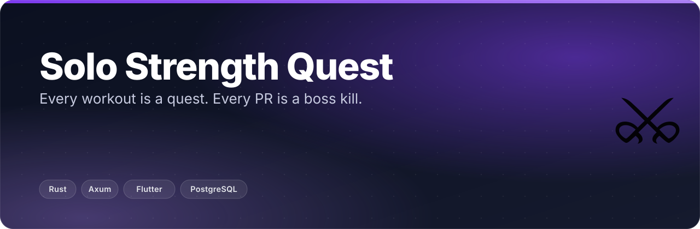
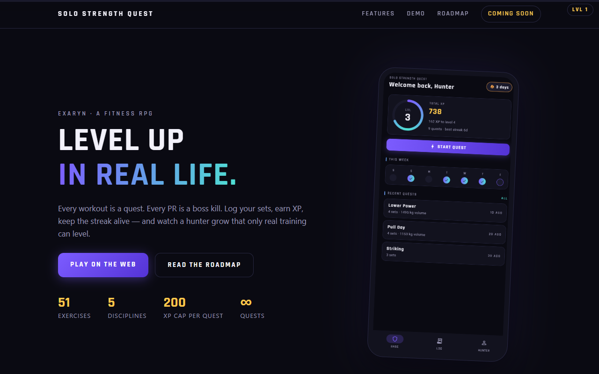
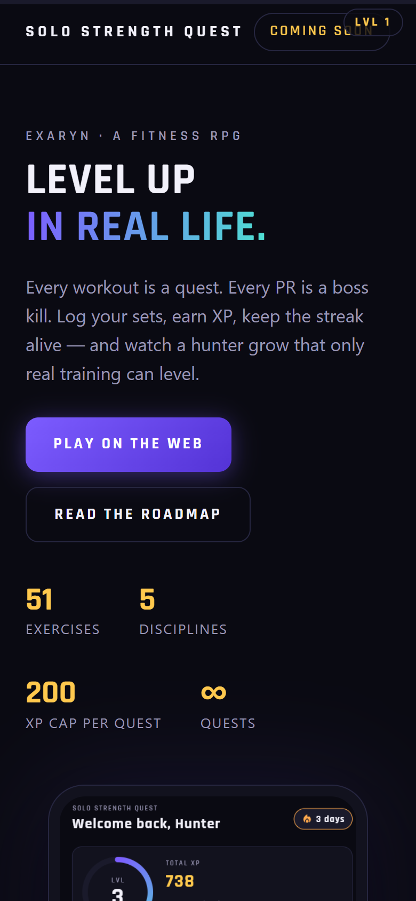
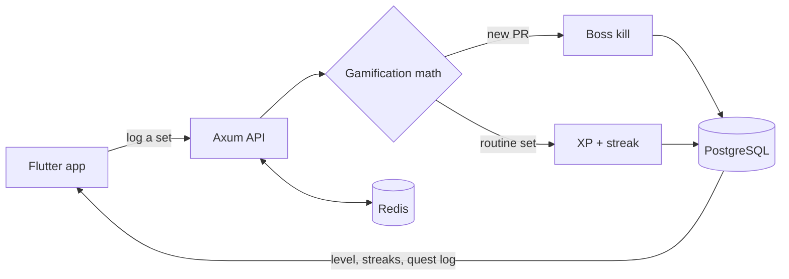

  <b>Level up in real life.</b> A fitness RPG: every workout is a quest, every PR is a boss kill.

  
  
  

> 🚧 **In development.** This is the public home of Solo Strength Quest —
> ⭐ star or 👁 watch this repo to catch the beta, release announcements, and
> the app-store launch.

## ✨ What it does

- Every workout you log becomes a quest, and progressive overload becomes XP.
- Hit a personal record and it lands as a boss kill, not just a new number.
- Your profile is a character sheet — level ring, STR/END/DIS stat bars, and
  locked/unlocked achievements — that only levels because you trained.
- A weekly grid and streak counter keep consistency honest.
- The quest log doubles as a real training history: sets, volume, dates, no
  massaging.

<table><tr>
<td width="33%"> Home — quests &amp; XP</td>
<td width="33%"> Hunter profile — stats &amp; streaks</td>
<td width="33%"> Quest log — workout history</td>
</tr></table>

## 🎮 Try the demo

<table><tr>
<td width="65%"> playable web demo</td>
<td width="35%"> playable web demo, mobile</td>
</tr></table>

▶ **[Play it yourself](https://chinmaygit8765.github.io/solo-strength-quest-play/)**
— source at [ChinmayGit8765/solo-strength-quest-play](https://github.com/ChinmayGit8765/solo-strength-quest-play).
Prefer a guided tour? **[Watch the 70-second interactive walkthrough](https://chinmaygit8765.github.io/exaryn-studio/demos/strength-quest.html)** —
log a deadlift session, hit a PR, watch it land as a boss kill and a level-up.

## 🧠 How it will work

The Flutter app logs a set to the Rust/Axum API, which runs the
gamification math server-side and decides quest vs. boss kill — that's the
source of truth. The same math is mirrored client-side in the app for
instant feedback, so XP can't drift between what you see and what you
earned. State lands in PostgreSQL through SQLx migrations; Redis backs
sessions and per-IP rate limiting.

<b>Stack</b>

| Layer | Choice |
|---|---|
| API | Rust + Axum + SQLx — typed handlers, service-layer gamification math, JWT auth, per-IP rate limiting |
| App | Flutter — feature-first structure, custom design system (XP rings, stat bars, quest widgets) |
| Data | PostgreSQL (SQLx migrations as source of truth) + Redis |
| Dev | One `docker compose up` for the whole local stack |

## 🗺️ Status & roadmap

- ✅ API — Rust/Axum service functional
- ✅ App — Flutter app functional (home, profile, quest log)
- ✅ Playable web demo — live preview of the UI/UX direction
- 🚧 Landing site
- 🔜 Beta
- 🔜 App-store launch

Everything ship-worthy gets announced right here.

---

Built by <a href="https://github.com/ChinmayGit8765">Chinmay</a> · part of the <a href="https://chinmaygit8765.github.io/exaryn-studio/">Exaryn</a> studio

